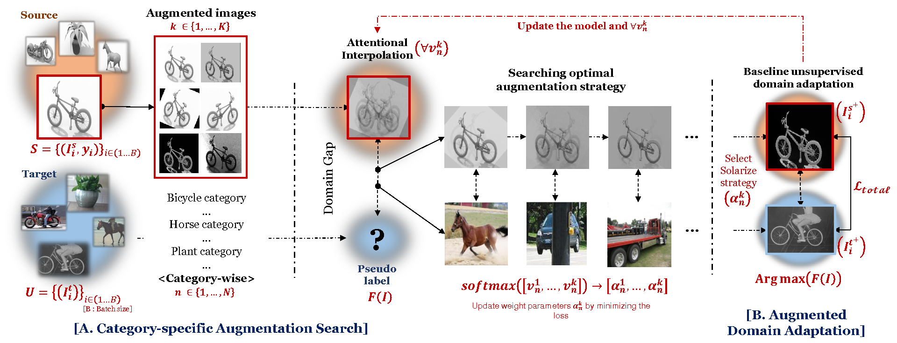
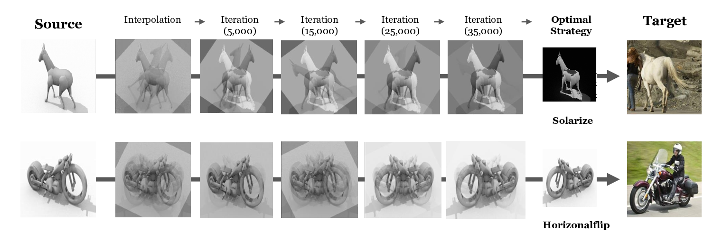

# CAA : Category-specific Augmentation Search Using Attentional Interpolation for Unsupervised Domain Adaptation (ECAI2025)


## Abstract ✨

This paper addresses a critical challenge in Unsupervised Domain Adaptation (UDA): achieving effective domain alignment without losing category-specific information. 
We propose a novel, category-specific augmentation method that applies targeted strategies tailored to each category. 
This approach reduces the visual domain gap and retains essential contextual information unique to each category, addressing the underfitting problems commonly encountered with traditional category-agnostic augmentation methods.
We propose an attentional interpolation method to reduce the computational demands of validating numerous combinations of category-specific augmentations. 
This method optimizes augmentation strategy selection within a single training session, significantly improving efficiency.
Our process, that is compatible with a range of existing UDA techniques, has undergone rigorous validation, demonstrating consistent performance improvements across various domain adaptation frameworks by maintaining fixed hyperparameters in integrated methods.




## News 📢
- 2025/07 🏆 Accepted paper at [ECAI'25](https://ecai2025.org/) conference 🎉🎉


## Requirements
```
```

## Datasets 📖


## Training 📝


## Results 🎯




## Citation 🔍
```
```
